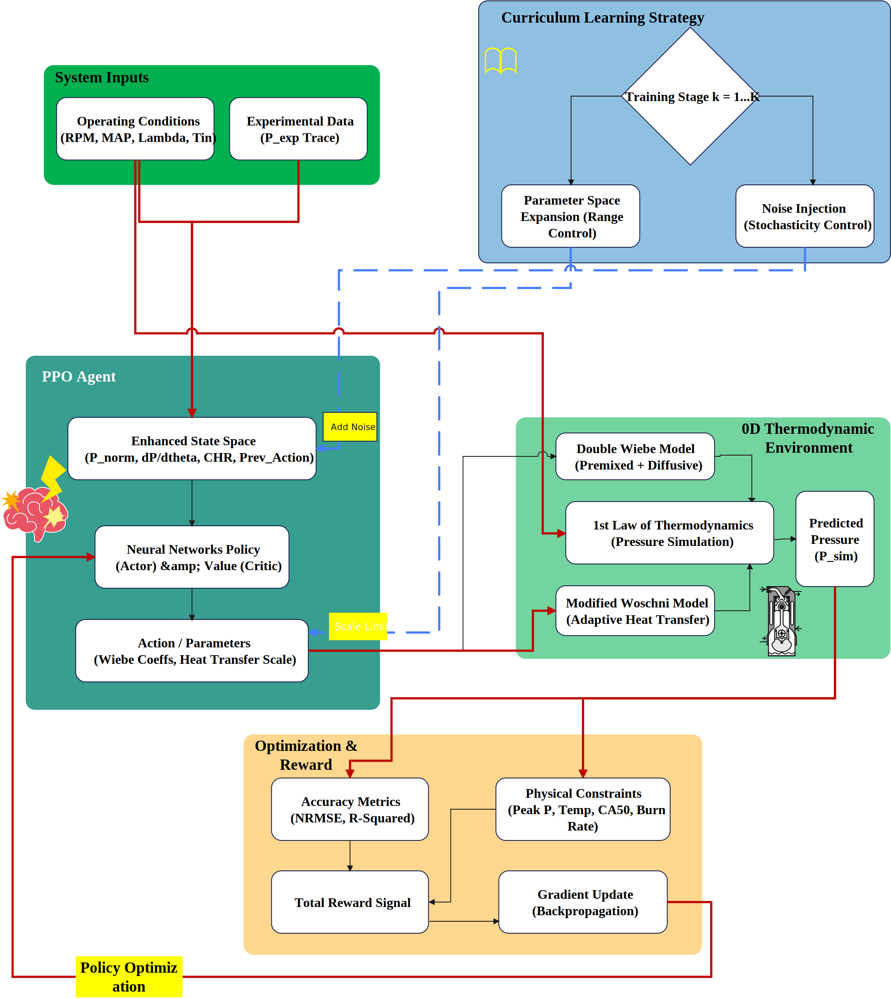

# Physics-Informed Curriculum RL for Double Wiebe Combustion Model Calibration

[](https://doi.org/XXXX)
[](https://python.org)
[](LICENSE)

> **Official code for:**
> Raeesi M, Shojaeefard MH. *Physics-Informed Curriculum Learning for Real-time
> Calibration of Double Wiebe Combustion Models: A Deep Reinforcement Learning


---

## Overview



This repository implements a **PPO-based curriculum reinforcement learning**
framework for calibrating Double Wiebe combustion models — solving the
ill-posed inverse problem of extracting physically consistent parameters from
in-cylinder pressure traces.

**Key results:**
- **0.26 ms** actor-only inference — 7,314× faster than Genetic Algorithm
- **91.5%** physical feasibility on out-of-distribution holdout
- **67%** reduction in compensation-effect Total-Variation vs. GA
- ECU-compatible memory footprint: **712 kB** (vs. ~12 MB for XGBoost)

---

## Repository Structure

```
.
├── src/
│   ├── environment/wiebe_env.py       # Gymnasium RL environment
│   ├── models/wiebe_functions.py      # Double Wiebe model (Numba-JIT)
│   └── utils/                         # Thermodynamics, data, visualization
├── scripts/
│   ├── train_ppo.py                   # Curriculum PPO training
│   ├── evaluate_agent.py              # Agent evaluation
│   ├── evaluate_all_splits.py         # 4-partition benchmark
│   └── compensation_analysis.py       # TV compensation analysis
├── config/default_config.yaml         # Hyperparameters
├── data/sample/generate_sample.py     # Synthetic demo case
└── docs/
```

---

## Installation

```bash
git clone https://github.com/mehrdadraeesi1-svg/wiebe-curriculum-rl.git
cd wiebe-curriculum-rl
pip install -e .
pip install -r requirements.txt
```

---

## Quick Start

```bash
# Generate synthetic demo case (known ground-truth Wiebe parameters)
python data/sample/generate_sample.py

# Train PPO agent
python scripts/train_ppo.py \
    --data_path path/to/data.csv \
    --config config/default_config.yaml

# Evaluate across all partitioning strategies
python scripts/evaluate_all_splits.py \
    --model_path runs/best_model.zip
```

---

## Results

| Method | R² (OOD) | Feasibility | Inference | TV (Regularised) |
|--------|-----------|-------------|-----------|------------------|
| **PPO (Ours)** | **0.971** | **91.5%** | **0.26 ms** | **0.077** |
| XGBoost | 0.943 | 66.1% | 0.31 ms | 0.184 |
| A2C | 0.951 | 78.3% | 0.28 ms | 0.121 |
| Genetic Algorithm | 0.968 | 82.4% | 1,900 ms | 0.231 |

*OOD = Out-of-Distribution holdout at distributional distance 1.112σ*

---

## Curriculum Learning

Three-stage curriculum progressively increases task complexity:

| Stage | Distributional Distance | Noise |
|-------|------------------------|-------|
| 1 | 0.161σ (interpolation) | Low |
| 2 | 0.412σ (near-OOD) | Medium |
| 3 | 1.112σ (full OOD) | High |

---

## Data

The framework is demonstrated with a **synthetic case** (included in
`data/sample/`) that has known ground-truth Wiebe parameters, allowing
framework verification without external data.

The experimental dataset used in the paper originates from:
> Yuan H, et al. *Thermodynamics-based data-driven combustion modelling.*
> Energy 2024;313. https://doi.org/10.1016/j.energy.2024.134074

---

## Citation

```bibtex
@article{raeesi2026wiebe,
  title   = {Physics-Informed Curriculum Learning for Real-time Calibration
             of Double Wiebe Combustion Models},
  author  = {Raeesi, Mehrdad and Shojaeefard, Mohammad Hassan},
  journal = {Energy Conversion and Management: X},
  year    = {2026},
  doi     = {XXXX}
}
```

---

## License

MIT License — © 2026 Mehrdad Raeesi, Iran University of Science and Technology

**Contact:** shojaeefard@iust.ac.ir
